# P2-FED Pipeline Architecture
## Federal Procurement Spend Intelligence

```mermaid
flowchart TB
    subgraph Sources["📥 Data Sources"]
        API[("USAspending.gov API v2")]
    end

    subgraph Ingestion["1️⃣ Data Ingestion"]
        FETCH["Paginated API Fetch<br/>100 records/call<br/>Cursor pagination"]
        RAW[("raw_awards_fy2024.csv<br/>24,800 rows")]
    end

    subgraph Transform["2️⃣ Data Transformation"]
        CLEAN["Data Cleaning<br/>• Type casting<br/>• Null handling<br/>• Hash generation"]
        CLEANED[("cleaned_awards.csv")]
        MODEL["Star Schema Transform<br/>• Fact/Dim split<br/>• FK generation"]
    end

    subgraph DataModel["📊 Data Model"]
        FACT[("award_fact<br/>24,800 rows")]
        DIM1[("agency_dim<br/>6 rows")]
        DIM2[("recipient_dim<br/>7,452 rows")]
        DIM3[("time_dim<br/>2,160 rows")]
        DIM4[("geo_dim<br/>58 rows")]
    end

    subgraph Quality["3️⃣ Quality Gates"]
        Q1["Schema Drift ✓"]
        Q2["Freshness ✓"]
        Q3["Completeness ✓"]
        Q4["Duplicates ✓"]
        Q5["Value Sanity ✓"]
        Q6["Ref Integrity ✓"]
        SCORE["Quality Score: 96.7%"]
    end

    subgraph Analytics["4️⃣ KPI Calculation"]
        KPI1["Spend Trends"]
        KPI2["Vendor Concentration<br/>HHI: 75.1"]
        KPI3["Change Detection"]
        KPI4["Summary Stats"]
    end

    subgraph Output["📄 Deliverables"]
        PDF1["Executive Summary PDF"]
        PDF2["Methodology/QA PDF"]
        DICT["Data Dictionary"]
        SAMPLE["Sample Data"]
    end

    API --> FETCH
    FETCH --> RAW
    RAW --> CLEAN
    CLEAN --> CLEANED
    CLEANED --> MODEL
    MODEL --> FACT
    MODEL --> DIM1
    MODEL --> DIM2
    MODEL --> DIM3
    MODEL --> DIM4

    FACT --> Q1 & Q2 & Q3 & Q4 & Q5 & Q6
    Q1 & Q2 & Q3 & Q4 & Q5 & Q6 --> SCORE

    FACT --> KPI1 & KPI2 & KPI3 & KPI4

    SCORE --> PDF1
    KPI1 & KPI2 & KPI3 & KPI4 --> PDF1
    SCORE --> PDF2
    FACT --> DICT
    FACT --> SAMPLE

    style API fill:#4f46e5,color:#fff
    style FACT fill:#059669,color:#fff
    style SCORE fill:#059669,color:#fff
    style PDF1 fill:#1e3a5f,color:#fff
    style PDF2 fill:#1e3a5f,color:#fff
```

---

## Pipeline Stages

### Stage 1: Data Ingestion
- **Source**: USAspending.gov API v2
- **Method**: POST requests with cursor-based pagination
- **Rate Limiting**: 0.25s delay between calls
- **Error Handling**: Retry with exponential backoff

### Stage 2: Data Transformation
- **Cleaning**: Type conversion, null handling, standardization
- **Deduplication**: MD5 hash on award_id + recipient + amount
- **Modeling**: Star schema with fact and dimension tables

### Stage 3: Quality Gates
| Gate | Threshold | Result |
|------|-----------|--------|
| Schema Drift | ≥95% | ✓ 100% |
| Freshness | ≥80% | ✓ 95% |
| Completeness | ≥90% | ✓ 100% |
| Duplicates | ≥95% | ✓ 100% |
| Value Sanity | ≥85% | ✓ 85% |
| Referential Integrity | ≥95% | ✓ 100% |

### Stage 4: KPI Calculation
- Spend trends by agency, time, geography
- Vendor concentration (HHI, Top-10 share)
- Change detection (QoQ, rank movements)

### Stage 5: Report Generation
- Executive Summary PDF
- Methodology/QA PDF
- Data Dictionary (Markdown)
- Sample Data (CSV)

---

## Data Flow Metrics

| Stage | Input | Output | Duration |
|-------|-------|--------|----------|
| Ingest | API | 24,800 rows | ~150s |
| Clean | Raw CSV | Cleaned CSV | ~2s |
| Model | Cleaned | 5 tables | ~1s |
| Quality | Model | Metrics | <1s |
| KPIs | Fact | JSON | <1s |
| Reports | All | 2 PDFs | ~3s |

**Total Pipeline Duration**: ~156 seconds

---

*Diagram created for P2-FED Pipeline v1.0*
