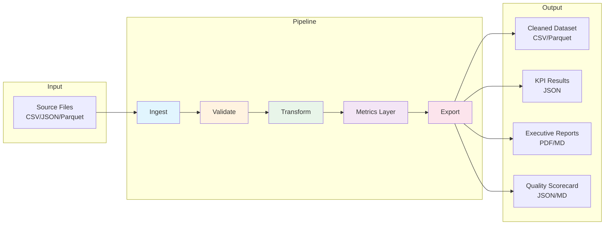
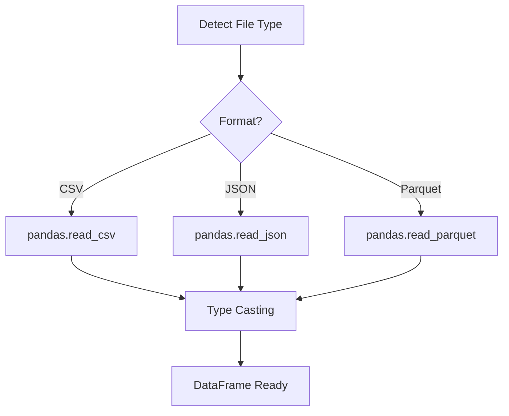
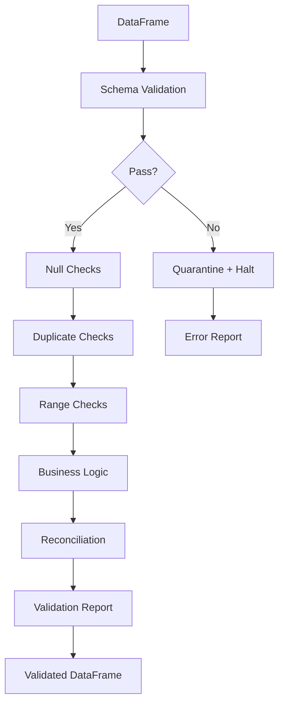
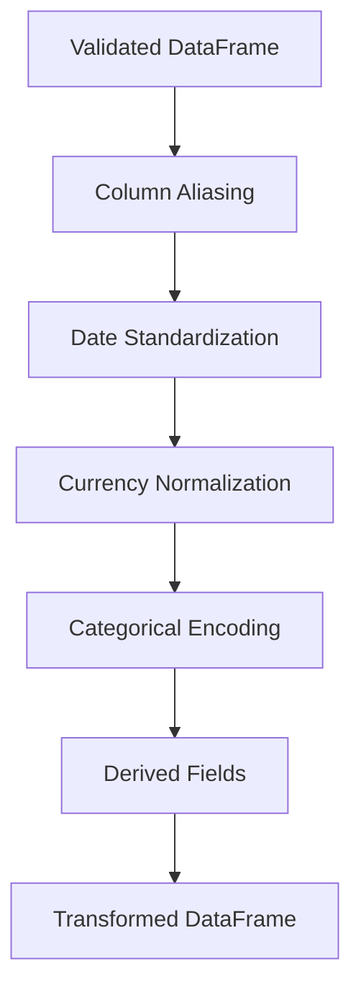
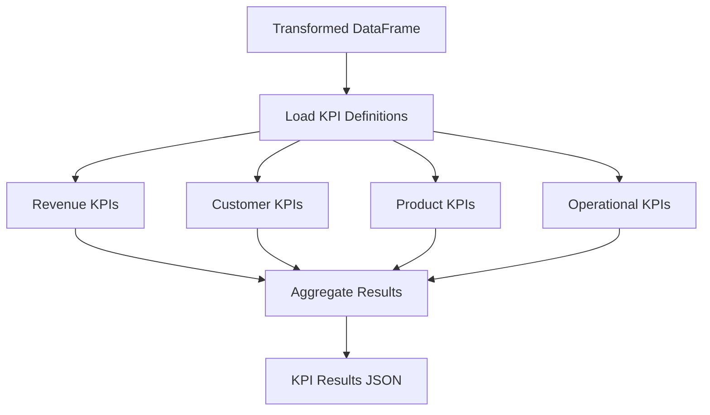
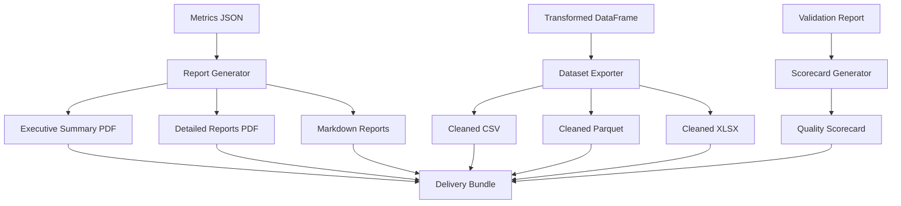
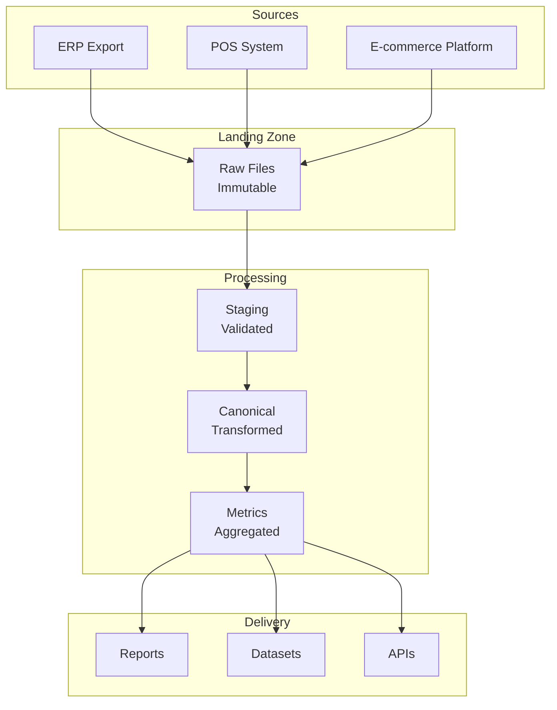
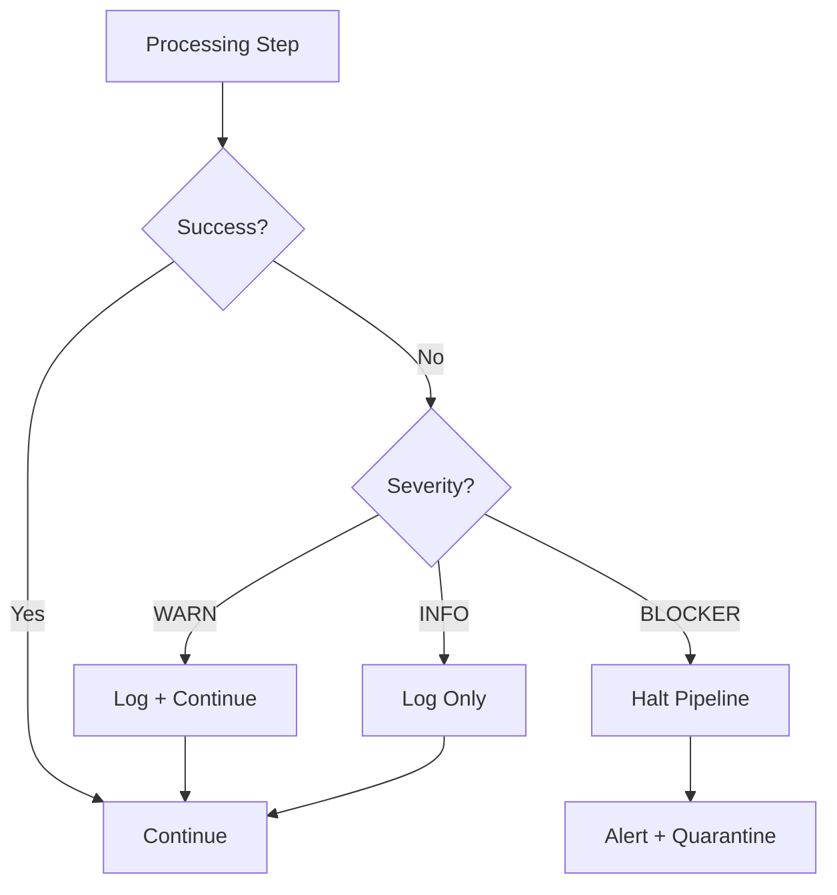

# Pipeline Architecture

> **Synthetic demo output for portfolio purposes.**
> This document demonstrates data pipeline architecture patterns for analytics engineering.

---

## Overview

This architecture describes a batch-oriented analytics pipeline that processes transactional data through standardized stages: ingestion, validation, transformation, metrics computation, and delivery.

---

## High-Level Architecture



---

## Stage Details

### Stage 1: Ingest

**Purpose**: Load raw data from source files into a processing-ready format.



**Key Operations**:
- File type detection (extension + magic bytes)
- Encoding detection (UTF-8, Latin-1, etc.)
- Initial type casting (dates, numerics, strings)
- Column name normalization (lowercase, underscores)
- Null standardization (`None` → consistent representation)

**Outputs**:
- Raw DataFrame in memory
- Ingestion metadata (file size, row count, detected schema)

---

### Stage 2: Validate

**Purpose**: Apply data quality checks defined in the schema contract and validation rules.



**Validation Gates** (executed sequentially):

| Order | Gate | Severity | Behavior |
|-------|------|----------|----------|
| 1 | Schema Match | BLOCKER | Halt if schema mismatch |
| 2 | Null Checks | BLOCKER/WARN | Quarantine critical nulls |
| 3 | Duplicates | BLOCKER | Remove exact duplicates |
| 4 | Range/Domain | WARN | Flag out-of-range values |
| 5 | Business Logic | WARN | Flag logical inconsistencies |
| 6 | Reconciliation | BLOCKER | Verify counts/sums match |

**Outputs**:
- Validated DataFrame (passing records only)
- Quarantine DataFrame (failing records)
- Validation report (JSON + summary stats)

---

### Stage 3: Transform

**Purpose**: Normalize, enrich, and prepare data for metrics computation.



**Transformations Applied**:

| Transform | Description |
|-----------|-------------|
| Column Aliasing | Map source columns to canonical names |
| Date Standardization | Convert to ISO 8601, UTC timezone |
| Currency Normalization | Convert to base currency (USD) |
| Categorical Encoding | Standardize enum values |
| Derived Fields | Calculate `fiscal_quarter`, `day_of_week`, etc. |
| Type Enforcement | Ensure strict types for downstream |

**Outputs**:
- Transformed DataFrame with canonical schema
- Transformation log (applied mappings)

---

### Stage 4: Metrics Layer

**Purpose**: Compute KPIs and aggregations per the KPI catalog.



**Computation Approach**:

1. **Load KPI definitions** from `kpi_definitions.yaml`
2. **Apply filters** (status = 'Completed', date range)
3. **Compute each KPI** using vectorized operations
4. **Aggregate** at required grain (daily, weekly, monthly)
5. **Format output** as structured JSON

**Example KPI Computation**:

```python
# KPI-001: Total Revenue
total_revenue = df[df['order_status'] == 'Completed']['order_total'].sum()

# KPI-003: Average Order Value
aov = (
    df[df['order_status'] == 'Completed']
    .groupby('order_id')['order_total']
    .first()
    .mean()
)

# KPI-008: Repeat Purchase Rate
customer_orders = df.groupby('customer_id')['order_id'].nunique()
repeat_rate = (customer_orders > 1).mean() * 100
```

**Outputs**:
- `metrics.json`: All computed KPIs
- `kpis/`: Individual KPI files (optional)
- Computation log with timing

---

### Stage 5: Export

**Purpose**: Generate deliverable artifacts in required formats.



**Deliverable Types**:

| Type | Format | Purpose |
|------|--------|---------|
| Executive Summary | PDF/MD | C-level overview |
| Detailed Analysis | PDF/MD | Deep-dive reports |
| Cleaned Dataset | CSV/Parquet/XLSX | Re-usable data |
| KPI Metrics | JSON | Programmatic access |
| Quality Scorecard | JSON/MD | Audit trail |
| Manifest | JSON | Delivery inventory |

---

## Data Flow Diagram



---

## Error Handling



**Error Categories**:

| Category | Example | Action |
|----------|---------|--------|
| Schema Error | Missing required column | Halt, reject file |
| Data Error | Invalid date format | Quarantine record |
| Business Error | Negative revenue | Flag, continue |
| System Error | Memory exhaustion | Retry with chunking |

---

## Scalability Considerations

### Memory Management

For large files exceeding available RAM:

```python
# Chunked processing pattern
CHUNK_SIZE = 100_000

for chunk in pd.read_csv(file_path, chunksize=CHUNK_SIZE):
    validated_chunk = validate(chunk)
    transformed_chunk = transform(validated_chunk)
    append_to_output(transformed_chunk)
```

### Parallel Processing

Independent operations can be parallelized:

```
┌─────────────────────────────────────────────────────────────────┐
│                    Sequential (dependencies)                     │
│  Ingest → Validate → Transform                                  │
├─────────────────────────────────────────────────────────────────┤
│                    Parallel (independent)                        │
│  ┌─────────────┐  ┌─────────────┐  ┌─────────────┐              │
│  │Revenue KPIs │  │Customer KPIs│  │Product KPIs │              │
│  └─────────────┘  └─────────────┘  └─────────────┘              │
├─────────────────────────────────────────────────────────────────┤
│                    Sequential (aggregation)                      │
│  Merge Results → Export                                         │
└─────────────────────────────────────────────────────────────────┘
```

---

## Technology Stack

| Layer | Technology | Purpose |
|-------|------------|---------|
| Language | Python 3.10+ | Core processing |
| Data Processing | pandas, NumPy | DataFrame operations |
| Validation | Custom + Pydantic | Schema enforcement |
| Configuration | YAML | Contracts, rules, KPIs |
| Testing | pytest | Unit and integration tests |
| Output Formats | CSV, Parquet, JSON, PDF | Deliverables |

---

## Configuration Files

| File | Purpose |
|------|---------|
| `schema_contract.yaml` | Expected columns, types, constraints |
| `validation_rules.yaml` | Quality check definitions |
| `kpi_definitions.yaml` | KPI formulas and metadata |

---

## Observability

### Logging

All stages emit structured logs:

```json
{
  "timestamp": "2026-01-21T10:30:00Z",
  "stage": "validate",
  "level": "INFO",
  "job_id": "job_20260121_001",
  "message": "Validation complete",
  "metrics": {
    "input_rows": 10000,
    "valid_rows": 9987,
    "quarantined_rows": 13,
    "duration_ms": 1234
  }
}
```

### Metrics

| Metric | Description |
|--------|-------------|
| `pipeline.duration_ms` | End-to-end processing time |
| `pipeline.rows_processed` | Total rows through pipeline |
| `pipeline.validation_pass_rate` | % passing all checks |
| `pipeline.quarantine_rate` | % quarantined records |

---

## References

- [Methodology](./methodology.md)
- [Quality Scorecard](./quality_scorecard.md)
- [KPI Catalog](./kpi_catalog.md)
- [Schema Contract](../configs/schema_contract.yaml)
